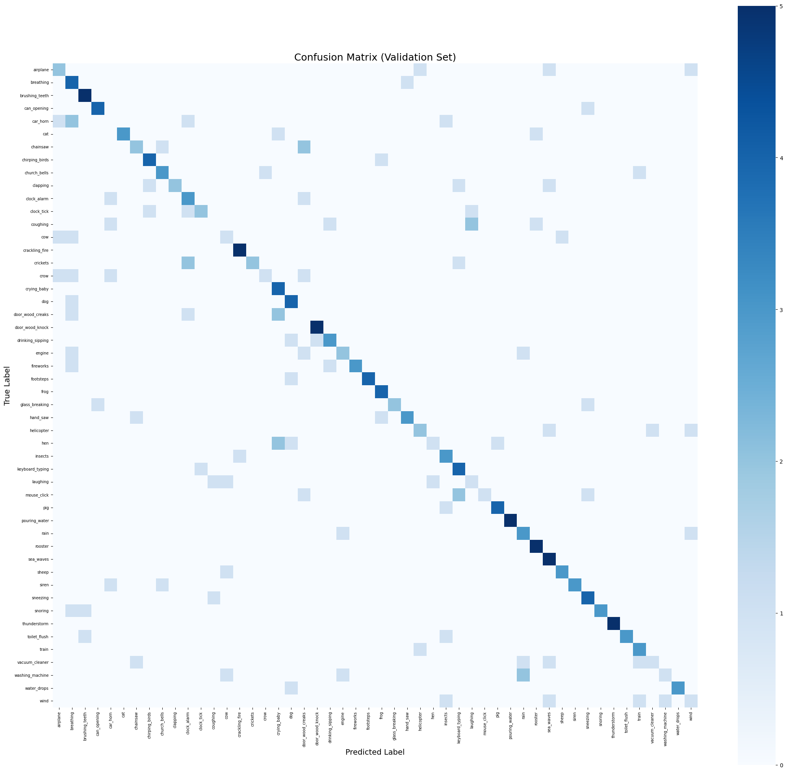
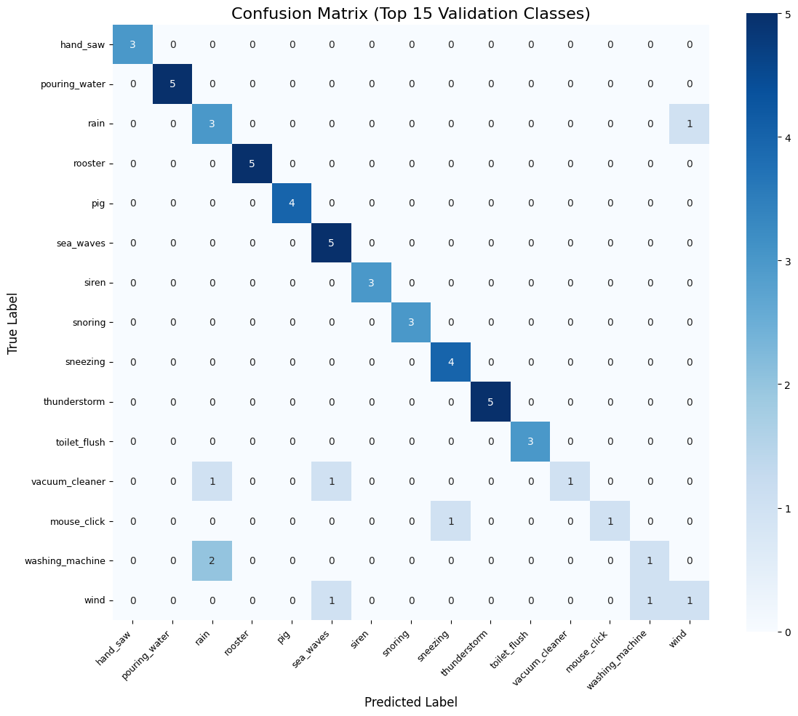

# CEG3004 Environmental Sound Classification

## Group ID: Pr_22

## Overview
This project develops a robust audio classification pipeline for Environmental Sound Classification (ESC-50). The system is designed to classify 50 sound classes under clean, noisy, and band-limited conditions using DSP-based feature extraction and machine learning.

## Objectives
- Extract meaningful DSP features
- Train a classifier on labeled data
- Ensure robustness under distortions (noise and band-limiting)
- Produce predictions for submission dataset

## Dataset
- 2000 audio clips
- 50 classes (40 per class)
- Each clip is 5 seconds
- Mono audio

Submission data includes:
- Clean
- Noisy
- Band-limited versions

---

## Pipeline

### 1. Preprocessing
- Resampling to 16kHz
- Silence trimming (light)
- Peak normalization
- Fixed-length padding/truncation (5 seconds)

### 2. Feature Extraction
The feature vector includes:

- Log-mel spectrogram
- MFCC
- Delta MFCC
- Delta-delta MFCC
- Spectral centroid
- Spectral bandwidth
- Spectral rolloff
- Zero crossing rate
- RMS energy
- Spectral flux

Each feature is summarized using:
- Mean
- Standard deviation
- Median
- 10th percentile
- 90th percentile

---

### 3. Robustness Strategy
Training-time augmentation:
- Random gain
- Additive noise
- Simulated band-limited filtering

No augmentation applied during prediction.

---

### 4. Model
Final model:
- Support Vector Machine (RBF kernel)

Selected after comparing:
- Logistic Regression (baseline)
- ExtraTrees
- SVM

---

## Results

## Results

| Model | Macro-F1 |
|------|--------|
| Logistic Regression | Baseline |
| ExtraTrees | ~0.53 |
| SVM (RBF) | **~0.574** |

The SVM model achieved the highest validation Macro-F1 score and was selected as the final model.

---

## Confusion Matrix

The confusion matrix below shows the classification performance on the validation set.

## Repository Structure

CEG3004_PROJECT_Pr22/
├── notebooks/ # Jupyter notebook implementation
├── results/ # experiment logs and visualizations
├── docs/ # methodology, analysis, reproducibility
├── submission/ # final model and predictions
├── README.md
├── requirements.txt

---

## Reproducibility

1. Open notebook in Google Colab
2. Install dependencies
3. Place dataset in correct directory
4. Run all cells
5. Outputs generated:
   - Pr_22_model.joblib
   - Pr_22_predictions.csv
